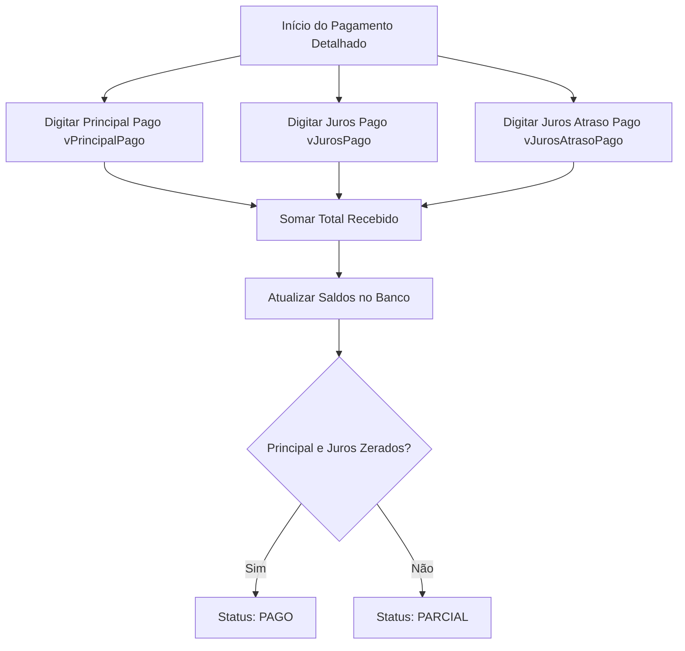

# 💳 Fluxo de Pagamento e Amortização de Parcelas

Este manual detalha os processos de baixa de parcelas, a lógica de amortização de valores parciais e o funcionamento do novo **Modo Detalhado (Manual)** de pagamento, integrado ao sistema Zap Empréstimos.

---

## 1. Métodos de Baixa e Registro de Pagamento

O sistema oferece dois modos principais para que o operador registre recebimentos:

### A. Baixa Rápida (Automática)
O operador insere o valor total pago pelo cliente e o sistema distribui o dinheiro de acordo com as seguintes prioridades:
1. **Cobrança/Perdão de Juros de Atraso:** Se a parcela estiver em atraso e "Cobrar juros" estiver ativado, os juros de atraso calculados são abatidos em primeiro lugar:
   $$V_{\text{restante}} = \max(0, V_{\text{pago}} - J_{\text{atraso}})$$
2. **Abatimento do Saldo:** O valor restante ($V_{\text{restante}}$) é amortizado de acordo com o seletor selecionado pelo operador:
   * **Capital (Principal):** 
     $$\text{novoPrincipal} = \max(0, \text{valorPrincipal} - V_{\text{restante}})$$
     $$\text{novoJuros} = \text{valorJuros}$$
   * **Juros da Parcela:**
     $$\text{novoJuros} = \max(0, \text{valorJuros} - V_{\text{restante}})$$
     $$\text{novoPrincipal} = \text{valorPrincipal}$$
3. **Novo Saldo Devedor:**
   $$\text{novoDevido} = \text{novoPrincipal} + \text{novoJuros}$$
4. **Status Resultante:**
   * Se $\text{novoDevido} \le 0.01$, a parcela é alterada para `PAGO`.
   * Se $\text{novoDevido} > 0.01$, a parcela é alterada para `PARCIAL`.

---

## 2. Modo Detalhado (Controle Máximo da Operação)

Projetado para dar flexibilidade total ao operador financeiro em negociações complexas, permitindo informar exatamente quanto do dinheiro recebido foi destinado a liquidar cada porção da dívida.

### Regras de Entrada de Dados (Inputs):
* **Principal Pago ($V_{\text{p\_pago}}$):** Valor máximo limitado ao saldo de principal atual da parcela ($\text{valorPrincipal}$).
* **Juros Pago ($V_{\text{j\_pago}}$):** Valor máximo limitado ao saldo de juros atual da parcela ($\text{valorJuros}$).
* **Juros de Atraso Pago ($V_{\text{a\_pago}}$):** Opcional (se aplicável), limitado aos juros de atraso calculados para o período.

### Matemática da Atualização no Banco de Dados:
No recebimento do payload pelo endpoint `/api/parcelas/[id]/pagar`, o banco é atualizado diretamente com as seguintes equações:
* **Novo Principal:**
  $$\text{novoPrincipal} = \max(0, \text{valorPrincipal} - V_{\text{p\_pago}})$$
* **Novo Juros Ordinário:**
  $$\text{novoJuros} = \max(0, \text{valorJuros} - V_{\text{j\_pago}})$$
* **Novo Saldo Devido da Parcela:**
  $$\text{novoDevido} = \text{novoPrincipal} + \text{novoJuros}$$
* **Incremento do Valor Pago Histórico:**
  $$\text{valorPagoAcumulado} = \text{valorPagoAnterior} + (V_{\text{p\_pago}} + V_{\text{j\_pago}} + V_{\text{a\_pago}})$$

---

## 3. Emissão de Recibo e Integração WhatsApp

Após a baixa ser gravada com sucesso e os logs de auditoria serem registrados:
1. **Recibo de Sucesso:** É apresentado um resumo visual mostrando detalhadamente cada componente pago e o saldo restante exato da parcela.
2. **Link do WhatsApp:** Gera um link amigável apontando para o número do cliente contendo uma mensagem detalhada do lançamento:
   > *"Olá, [Cliente]. Confirmamos o recebimento do seu pagamento de R$ [ValorTotal] em [Data]. Detalhamento: Principal Pago: R$ [Capital], Juros Pago: R$ [Juros], Juros Atraso Pago: R$ [Atraso]. Saldo Restante da Parcela: R$ [Restante]. Obrigado."*
