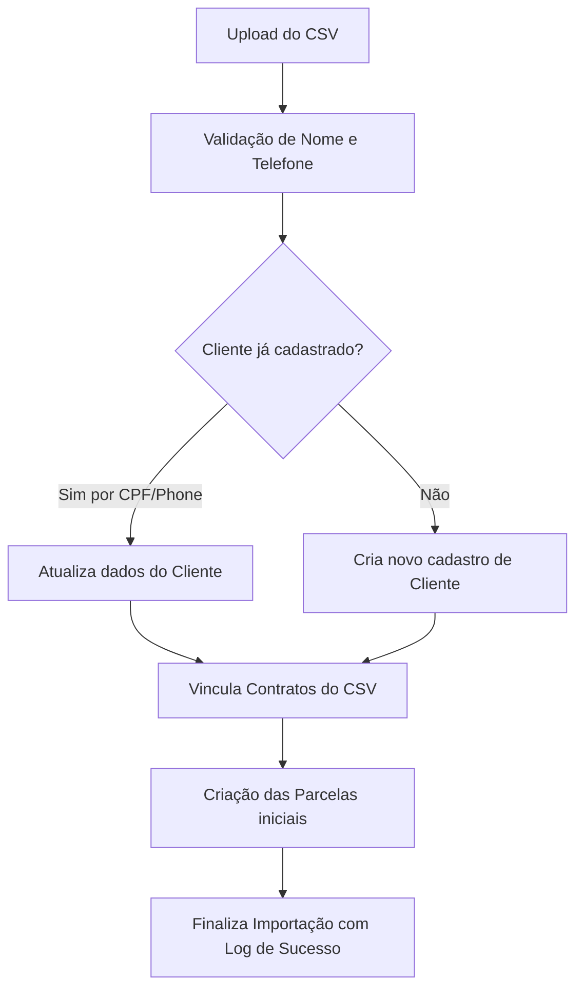

# 📥 Importação em Massa via CSV e Gestão de Leads

Este manual descreve a funcionalidade de importação em lote de clientes e contratos a partir de planilhas CSV, detalhando os templates aceitos, regras de validação na API e o sistema de criptografia para proteção de dados sensíveis.

---

## 1. Estrutura de Arquivos CSV Suportada

O sistema aceita a importação de planilhas formatadas em CSV (separadas por vírgula `,` ou ponto e vírgula `;`). Recomenda-se o uso do template padrão para garantir o processamento correto.

### Campos Suportados para Cadastro de Leads/Clientes:
* **nome:** Nome completo do cliente (Obrigatório).
* **phone:** Número de telefone com DDD (Obrigatório, ex: `11999999999`).
* **cpf:** CPF do cliente (Opcional, apenas números).
* **email:** Endereço de e-mail (Opcional).
* **endereco / cidade / estado:** Dados de localização (Opcionais).
* **profissao / rendaMensal:** Informações profissionais (Opcionais).
* **perfilTaxa:** Taxa padrão a ser pré-configurada para o cliente (ex: `10%`, `20%`, `30%` ou valor personalizado).

---

## 2. Processo de Integração e Prevenção de Duplicidades

Durante o upload da planilha, a API `/api/importar` executa uma rotina de validação e correspondência em lote:



### Regras de Correspondência e Merge:
1. **Identificação por CPF:** Se o CPF fornecido na linha já existir no banco, a API atualiza os dados do cadastro existente em vez de criar um novo.
2. **Identificação por Telefone:** Caso o CPF não seja fornecido, o número de telefone (após limpeza de caracteres especiais) é utilizado como chave secundária para identificar cadastros duplicados.
3. **Limpeza Automática de Strings:** Todos os números de CPF e Telefone são sanitizados automaticamente via regex, removendo espaços, pontos, hifens e parênteses.

---

## 3. Segurança e Criptografia de Dados Sensíveis

Para manter a privacidade dos dados cadastrais e em conformidade com as melhores práticas de segurança de dados (como a LGPD), o banco de dados implementa criptografia nos campos sensíveis:
* **Campos Criptografados:** O número de telefone (`phone`), o endereço completo (`endereco`) e o documento pessoal (`cpf`) são criptografados antes de serem persistidos na base de dados Postgres.
* **Algoritmo de Proteção:** Utiliza criptografia simétrica forte (como `AES-256-GCM` com chave de criptografia armazenada de forma segura nas variáveis de ambiente do servidor).
* **Decodificação em Tempo de Execução:** O sistema descriptografa os dados automaticamente ao renderizar as telas no frontend e ao gerar as mensagens de WhatsApp, mantendo os dados protegidos em repouso no banco de dados Neon.

---

## 4. Templates de Exemplo (Markdown / Obsidian)

Você pode criar sua planilha de importação no Excel ou Google Sheets e exportar como CSV. Abaixo está o formato textual esperado das primeiras linhas:

```csv
nome,phone,cpf,email,rendaMensal,perfilTaxa
Jose da Silva,11988887777,12345678909,jose@email.com,4500.00,10%
Maria Souza,21977776666,98765432100,maria@email.com,5200.00,20%
Carlos Pereira,31966665555,,carlos@email.com,,30%
```
