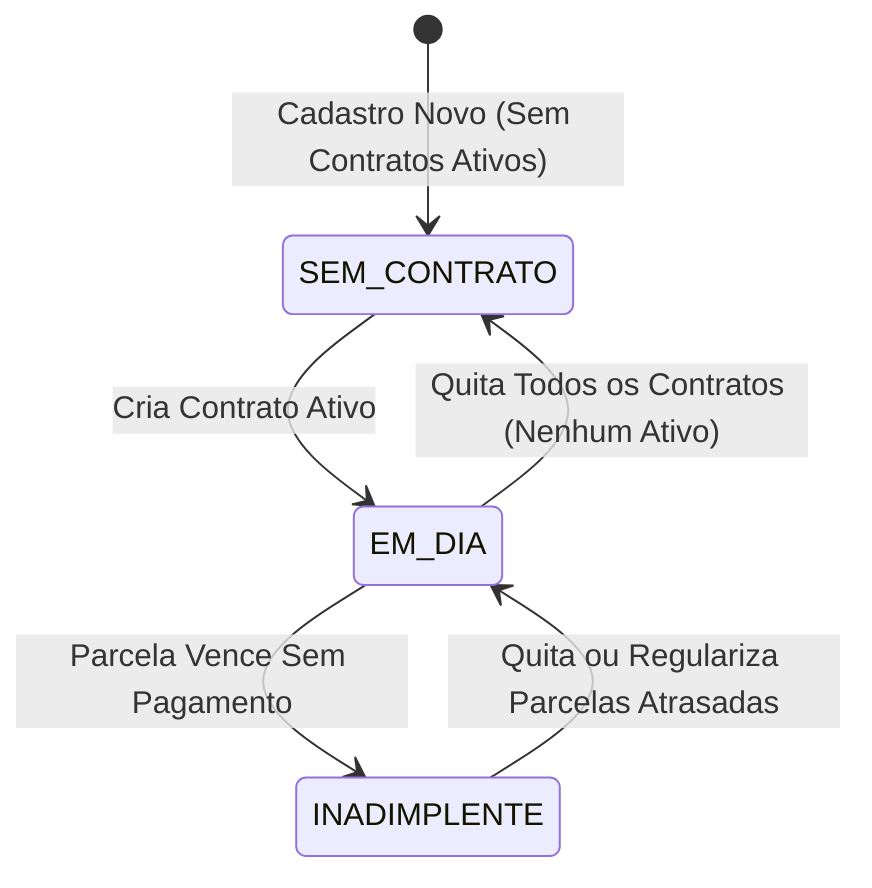

# 📊 Relatórios, Business Intelligence (BI) e Saúde Financeira

Este manual descreve a arquitetura de análise gerencial do Zap Empréstimos, detalhando os indicadores de BI, a classificação de saúde de carteira de clientes, a listagem de cobrança analítica e a separação entre retorno de capital e lucro.

---

## 1. Saúde Financeira da Carteira de Clientes

O sistema computa em tempo real a classificação dos clientes cadastrados para fornecer um diagnóstico preciso da saúde da carteira de crédito. Cada cliente é agrupado em um dos três status a seguir:

### Regras de Classificação:
1. **INADIMPLENTE (Em Atraso):**
   * O cliente possui pelo menos um contrato no status `ATIVO` e que contém parcelas não pagas (status `PENDENTE`, `ATRASADO` ou `PARCIAL`) com data de vencimento inferior à data atual ($D_{\text{vencimento}} < D_{\text{atual}}$).
2. **EM DIA:**
   * O cliente possui pelo menos um contrato ativo no status `ATIVO` e **todas** as parcelas desse contrato com vencimento no passado já estão marcadas como `PAGO` (ou não há parcelas vencidas acumuladas).
3. **SEM CONTRATO ATIVO:**
   * O cliente não possui nenhum contrato ativo no status `ATIVO` (pode ter apenas contratos `QUITADO` ou `CANCELADO`, ou nenhum contrato criado).

---

## 2. Relatório Analítico de Clientes em Atraso (Devedores)

Os clientes classificados como **Inadimplentes** são listados em uma seção gerencial ordenada de forma inteligente para otimizar as cobranças:
* **Ordenação de Prioridade:** Ordenados de forma decrescente pelo maior número de dias de atraso registrado na parcela vencida mais antiga:
  $$\text{diasAtrasoMax} = \max(d_{\text{atraso\_parcela\_1}}, d_{\text{atraso\_parcela\_2}}, \dots)$$
* **Total Vencido Acumulado:** A soma de todas as parcelas vencidas do cliente que estão ativas:
  $$\text{totalAtrasado} = \sum V_{\text{devido\_parcelas\_vencidas}}$$
* **Cobrança Expressa:** Atalho WhatsApp para envio rápido de texto amigável já formatado com o nome do cliente, dias de atraso e o valor total acumulado devido.

---

## 3. Retorno de Capital vs Lucratividade (Amortização de Contratos)

Diferenciar o retorno do capital investido (principal) do lucro real obtido (juros pagos) é essencial para medir a eficiência da operação. O painel BI calcula e separa esses montantes de forma detalhada:

### A. Retorno de Principal (Capital Amortizado)
Representa a recuperação do valor nominal inicial que foi emprestado aos clientes.
* **Capital Investido ($C_{\text{investido}}$):** Soma do valor principal de todas as parcelas de contratos de empréstimo.
* **Capital Retornado ($C_{\text{retornado}}$):** Soma do principal de parcelas com status `PAGO`.
* **Percentual de Retorno de Capital:**
  $$\% \text{ Retorno} = \frac{C_{\text{retornado}}}{C_{\text{investido}}} \times 100$$

### B. Lucro Realizado (Juros Recebidos)
Representa o faturamento real da operação financeira, gerado pelos juros e juros de atraso cobrados e quitados pelos clientes.
* **Lucro Projetado ($L_{\text{projetado}}$):** Soma dos juros contratados das parcelas.
* **Lucro Realizado ($L_{\text{realizado}}$):** Soma dos juros de parcelas com status `PAGO`.
* **Percentual de Lucro Realizado:**
  $$\% \text{ Lucro Realizado} = \frac{L_{\text{realizado}}}{L_{\text{projetado}}} \times 100$$

---

## 4. KPIs Financeiros e Lucro Líquido Real

O dashboard de relatórios integra os gastos operacionais cadastrados no módulo de despesas para calcular o resultado líquido real do período:
* **Faturamento Bruto de Juros:**
  $$F_{\text{juros\_mes}} = \sum V_{\text{juros\_recebidos\_mes}}$$
* **Despesas Operacionais:**
  $$D_{\text{operacionais\_mes}} = \sum V_{\text{despesas\_pagas\_mes}}$$
* **Lucro Líquido Real:**
  $$L_{\text{liquido}} = F_{\text{juros\_mes}} - D_{\text{operacionais\_mes}}$$
* **Taxa de Adimplência do Período:** Calculada exclusivamente sobre as parcelas cujas datas de vencimento já ocorreram:
  $$\text{Adimplência} = \frac{\text{Qtd Parcelas Pagas Vencidas}}{\text{Qtd Total de Parcelas Vencidas}} \times 100$$
